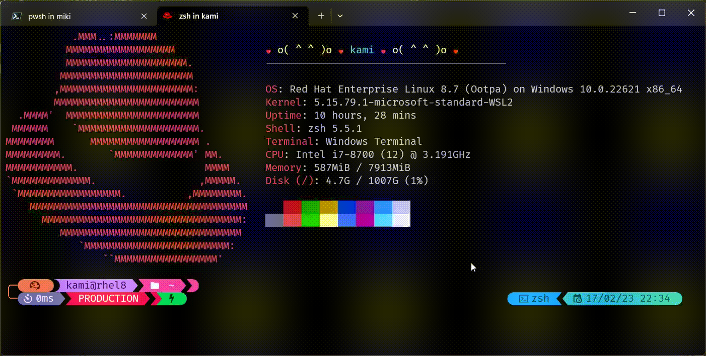
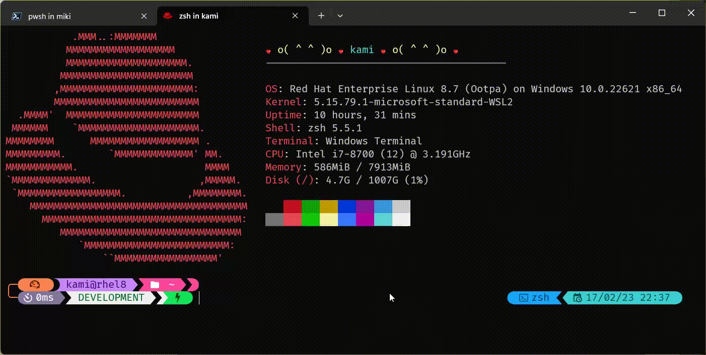
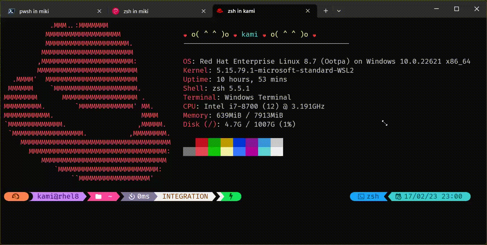

# kaminou.omp.theme rendering preview

## kami.omp.json

## kami-sama.omp.json (mnemonic for the long version on 2 lines =þ)

# kaminou.omp.theme (environment segment) rendering preview
in the shell run control file (.zshrc, .bashrc...) add an export ENV="PRODUCTION"  # PROD* | INT* | DEV*

## kami-sama.omp.json

## kami.omp.json (environment segment)

